# Personal Website
This website will be a personal portfolio about myself, it will show my understanding of HTML5 elements, responsive designing and the use of JavaScript

## Software used
For the creation of my website i used sublime text editor, on my MacBook.

### Initial Sketches

This is the initial design of my homepage that i drew up. This is the homepage at 1000px 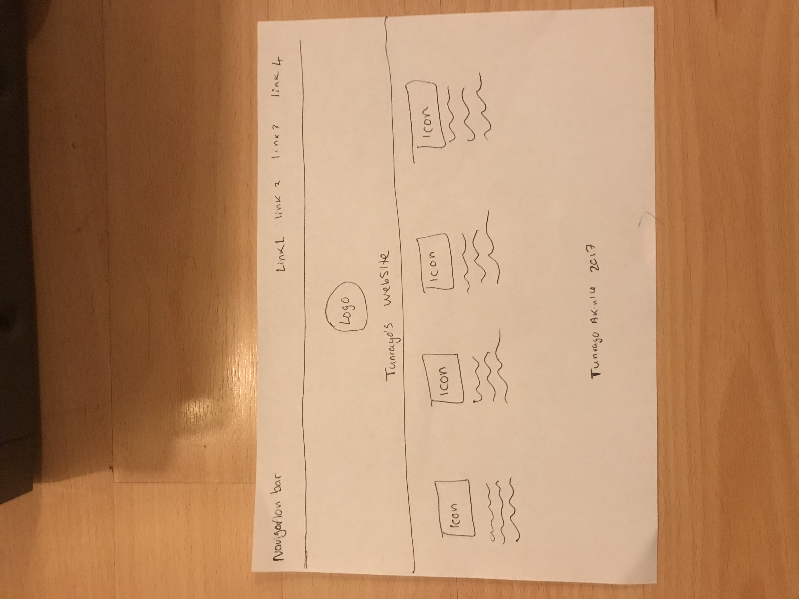.

This is the second design of my homepage that i drew up. This is the homepage at 1000px.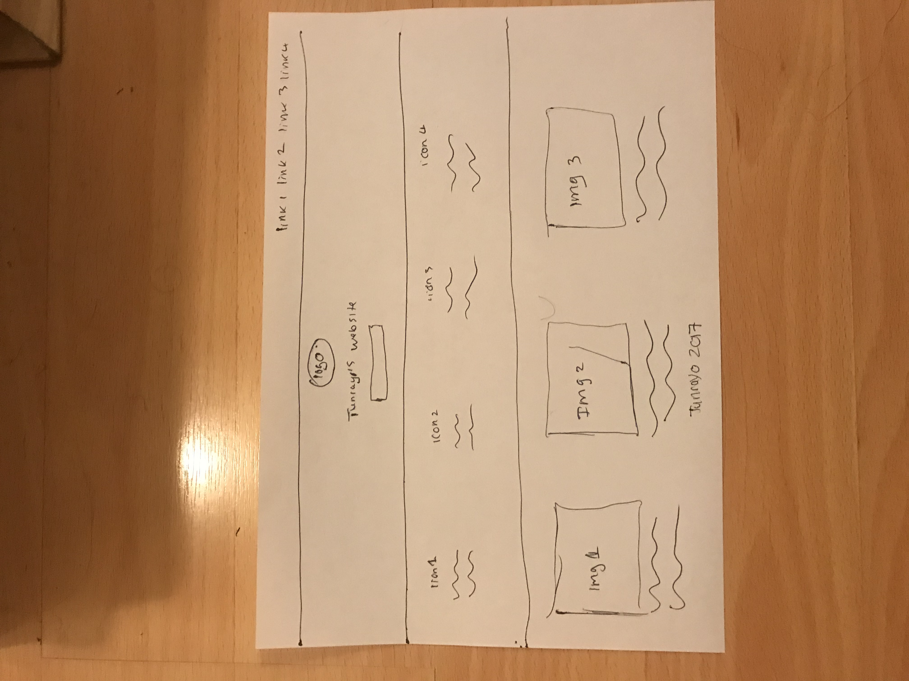.

This is the design of my homepage and game page in the mobile view, this is what I hope it too look like in this view.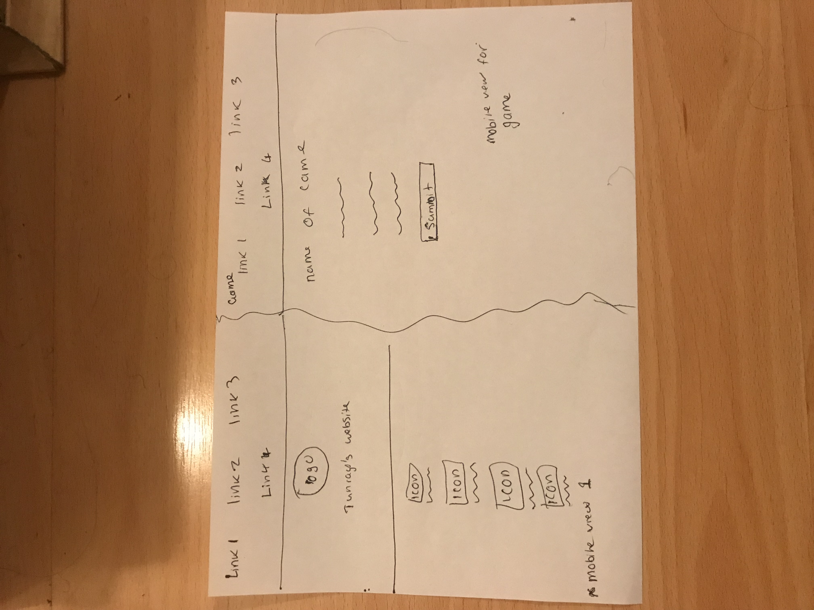.

This is the drawing plan of how the links within my webpage will look.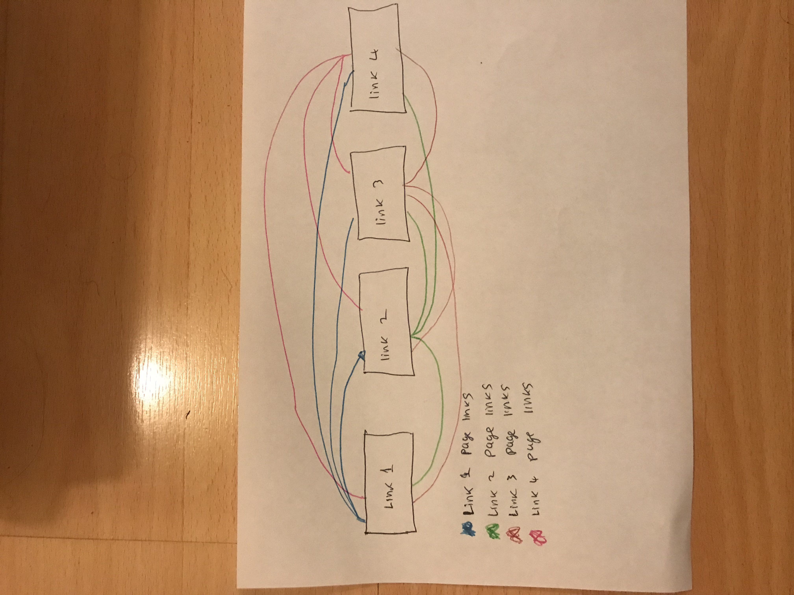.

This is the drawn design of my contact page, the contact form will be animated and the button section will be google maps 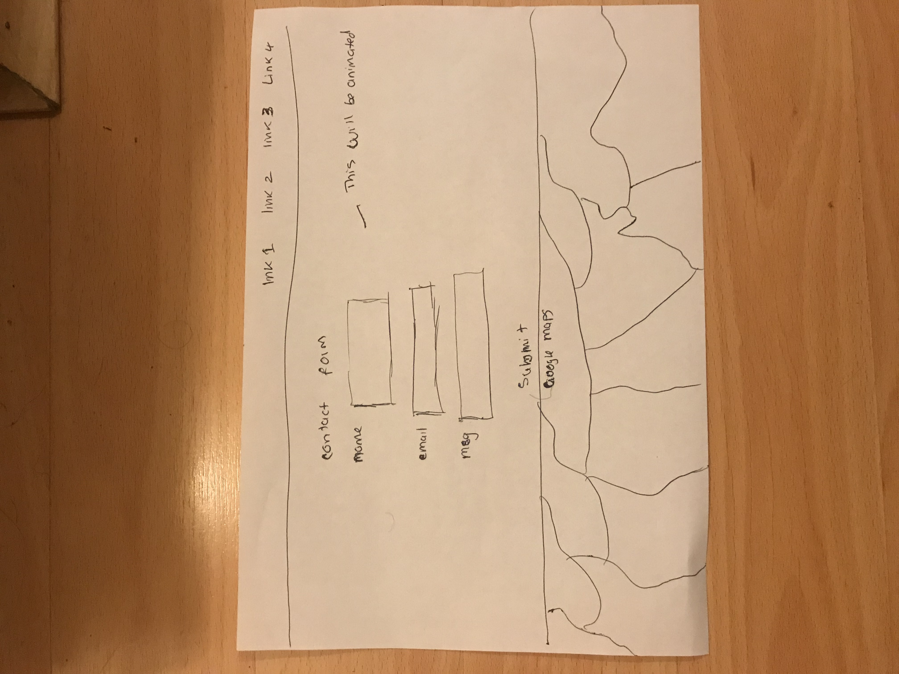.

#### Evidence of user testing
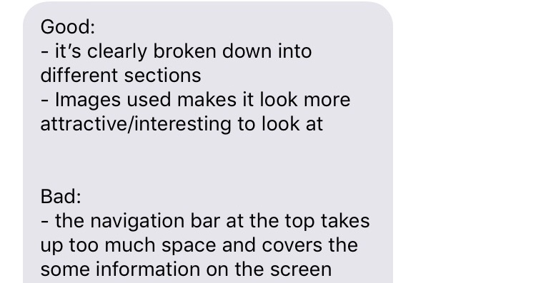.
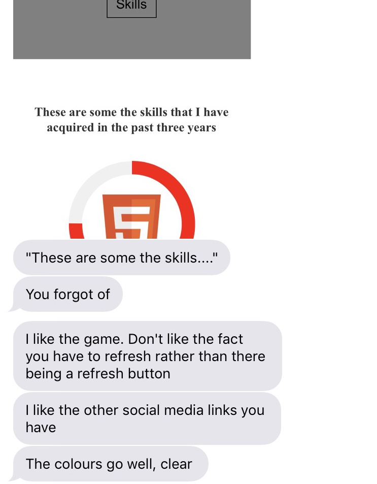.
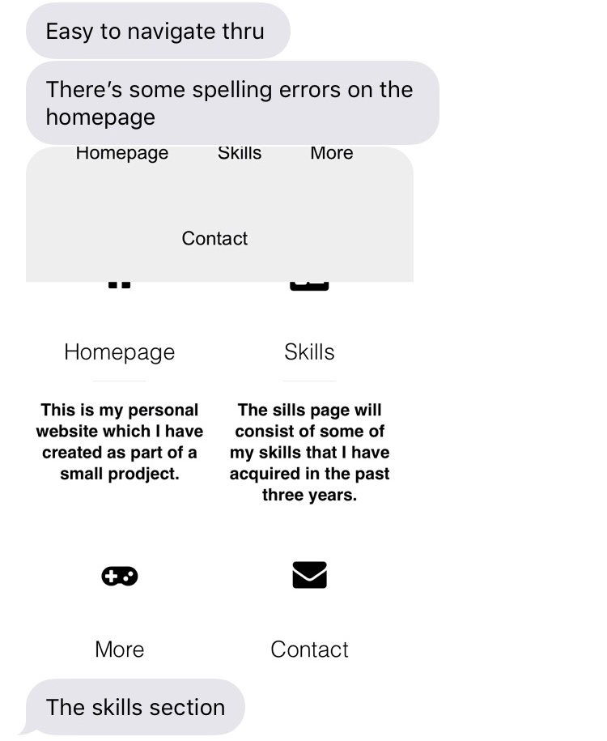.
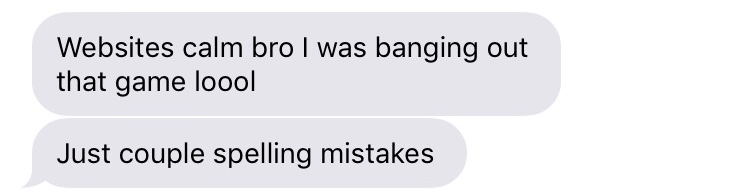.
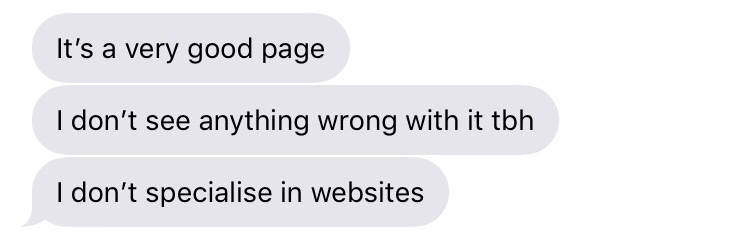.
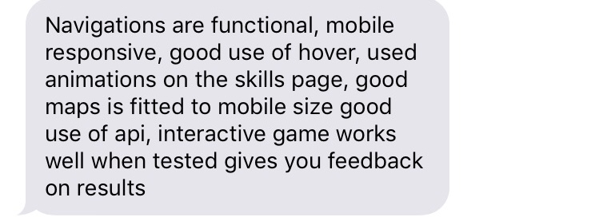.

#### Built with the following frameworks
JavaScript used for design elements
HTML5 used for creating my webpage
css uses for the presentation of my webpage

##### Links of sites used for the creation of my webpage
https://gist.github.com/PurpleBooth/109311bb0361f32d87a2
https://rawgit.com/fletcher/human-markdown-reference/master/index.html
https://idpedir.dmu.ac.uk/nidp/idff/sso?id=624&sid=0&option=credential&sid=0
https://www.youtube.com/
https://codepen.io/
https://validator.w3.org/
https://www.w3schools.com/

